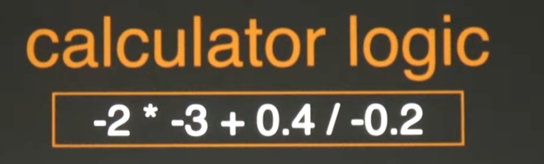
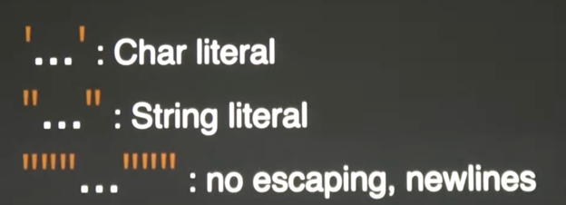

# 머릿글

들어가기에 앞서, 좋은 강의 영상을 제공해주신 코드스피츠에 감사합니다. 이 글은 코드스피츠 - 코틀린 강좌 영상을 주관적으로 정리한 글입니다. 
그래서 영상의 내용도 많은데, 제가 오버랩되서 떠오른 내용도 많습니다 ㅎㅎ.
틀린 부분이 있다면 피드백 부탁드립니다.

[영상 링크](https://www.youtube.com/watch?v=1OzBh2Uuj2s&t=21s)

## 코틀린에 대한 이해

- 코틀린은 독립된 언어로 여러 플랫폼에서 번역되는 가운데서도 고유의 철학을 유지
  - 다만 JVM 에는 호환성이 높으나, 다른 언어는 Reflection 이나 GC가 없는 언어에서는 호환성이 그다지 높지 않음 
  - 안드로이드, IOS 를 코틀린으로 대체하면 사실상 공통로직 한벌짜는데는 좋은데, 플러터 처럼 공통 UI 를 지원하지는 않아서 인력이 증강될 확률이 높음.

## 언어 시스템의 형

### 원시형 (Primitive)
- 대입이나 함수 인자 전달 또는 반환시 복사됨
  - Pointer 가 없고, 원시형과 참조형의 차이가 발생하므로 Boxing / Unboxing 개념이 도입됨. (SmartPointer 처럼 참조(메소드나 기타 등등) 를 여러개 가질 수 가 없으므로)
    - 요건 **예전 C++ 배울때랑 Rust 공부할 때가 떠올라서 이해가 잘됬음**
- 언어에 따라 스택메모리에 잡아서 속도가 빠름 -> 요건 메모리 지역성
  - 내 기억상 컴파일 시점에 메모리 사이즈가 결정될 수 있는 것들이 주로 Stack 에 올라갔고, 그 외에 것들이 Heap 에 올라갔던 것으로 기억 (사이즈가 동적으로 할당되야 하기에)
    - 스레드 공유 시점에서도 다른데 이건 뭐 여기서 굳이 얘기 안해도 될것 같아서 안적겠음.

### 참조형 (Reference)
- 대입 등에서 참조만 복사됨
- 대부분의 언어에서 힙이라 불리는 영역을 사용

## 코틀린 기본형

- 위에서 Boxing / UnBoxing 을 언급했는데 코틀린에서는 이를 각 플랫폼에 맞게 번역함(함 보다는 시킴이 더 맞는 뜻일거 같기도..).
  - 그 이유는 사실 Kotlin 은 불변이냐 아니냐가 중요하지, 뭐가 원시형인지 아닌지는 별로 중요하지 않음. (어차피 불변형이면 복사되던 참조되던 못바꾸기때문에 중요하지 않다고 생각)
  - 다만 모두 버릴수 없음, 성능에 관한글을 읽어보면 원시형 배열을 썼을때 Wrapping 된 타입의 Collection 보다 성능이 조금이라도 더 좋은 경우가 많기 때문. (그리고 메모리는 효율적으로 쓰는게 좋으니깐.. 아무리 상관없다고 해도 다 버릴순 없다고 생각함.)
    - Clean Architecture 에도 나오듯이 우리의 코드는 어차피 하드웨어 안에서 동작하므로 하드웨어를 효율적으로 사용하는 것도 중요하니깐..

## 코틀린 내장형 (built - in)

### Any

- 모든 것의 부모

### Nothing

- 모든 것의 자식 (모든 Type 에 대입이 가능함.)
  - 강의를 들으면서 궁금했던게 현실세계로 가져오면 이건뭘까 ㅎㅎ? -> 잡소리입니다 ㅎㅎ..
  - 제어흐름 도중에 Nothing 을 만나게 되면 예외가 발생함 (우리가 호출하는 예외랑은 다른건가..?)

### Unit

- 없음을 나타내는 형이자 싱글톤 객체 -> 이거 저번에 Medium 글 읽다가 Lambda 와 함께 Unit 을 만든이유에 관한 토픽을 봤었는데 기억이 잘 안난다 ㅎㅎ.. 다시 읽어봐야지
- 근데 Hika 님의 설명이 굉장히 좋았음 (밑에 간단 요약 정리)
  - Basic 이라는 언어에서는 프로시저로 선언해서 만들면 리턴값이 없음, 펑션으로 만들면 리턴값이 있음
  - Java 랑 C 는 그래서 펑션에서 리턴값이 없는 경우를 Void 나 0 으로 사용했음
    - **Kotlin 에서는 프로시저를 없애기로 마음먹음, 그래서 Unit 이라는 "아무것도 리턴하지 않음을 뜻" 하는 리턴값을 만듬 -> JS 에서는 Undefined**

### Throwable

- 코틀린에서는 CheckedException 을 다 없앰. 모두다 UnCheckedException 으로 변경
  - 근데 왜 CheckedException 을 없앴을까? 그 이유는 잘 모르겠음. MultiPlatform 을 염두에 둔건가?

### Function

- 코틀린이 진정한 의미에서 Function 이 1급 객체인 이유
  - 람다는 인터페이스의 익명 객체, 함수랑 다른점이 있음.

### KClass, KCallable, KProperty, KFunction, KType - ReflectionType

- Kotlin 은 Self Description 이 가능한 언어, Reflection 의 도움을 받지 않아도 언어자체에서 지원됨. 
  - 예를 들면 Class 를 생성하면 KClass 가 생성됨.
  - 언어를 파싱하면 AST 가 생기는데 -> 이게 Runtime 에서 사용가능 (그니까 요게 사실은 XXKClass 요런게 자동으로 생겨서 런타임에 이용가능하다? 이런느낌으로 나는 이해했음)
    - How? 이유는 코틀린이 컴파일되는데 2 단계를 거치기 때문임. -> Kotlin Compile (이 단계에서 KClass 를 이용가능하다고 느껴짐.) -> Platform Kotlin

## 실습

### 1 Question



- 분할 정복을 이용했음, 학부시절이 생각났음

```kotlin
package calculator

val trim = """[^.\d-+*/]""".toRegex() // white list 만 trim
val groupMD = """((?:\+|\+-)?[.\d]+)([*/])((?:\+|\+-)?[.\d]+)""".toRegex()

fun trim(v: String): String {
    return v.replace(trim, "")
}

fun repMtoPM(v: String): String = v.replace("-", "+-") // kotlin replace -> replaceAll 과 동일

fun foldGroup(v: String): Double = groupMD
    .findAll(v)
    .fold(0.0) { acc, curr ->
        val (_, left, op, right) = curr.groupValues // capture 된 group 의 배열이 담겨있음.
        val leftValue = left.replace("+", "").toDouble()
        val rightValue = right.replace("+", "").toDouble()
        val result = when (op) {
            "*" -> leftValue * rightValue
            "/" -> leftValue / rightValue
            else -> throw Throwable("Invalid operator $op")
        }
        acc + result
    }

fun calc(v: String) = foldGroup(repMtoPM(trim(v)))
```

### 코틀린 문자열



### 형 추론 관련 이야기

- **형 추론은 좋은데, 컴파일 타임이 길어질 수도 있고, strict 모드로 걸면 컴파일이 안됨**
  - strict 로 하면 컴파일이 정말 빨라진다함 -> 깜짝놀랐다.. 한번 팀원들에게 이야기를 해봐야겠다. 
  - 아님 노가다 뛰어서 한번 다 바꾸고 컴파일시간 재볼까도 고민중.. (얼마나 효율적일지)

### 정규식 관련 이야기

- 기본 3연산으로 되어 있음
  - 접합, 반복, 선택 -> 정규식도 나중에 제대로 한번 공부하자.. 맨날 하자 해놓고 겉할기정도로 하고 안해서 스터디로 해야할것 같다 이런건. 아님 알고리즘으로 풀면서 학습하자
  - 캡쳐 그룹(...) / 비캡쳐 그룹(?:...) -> 메모리에 올릴래 말래?
  - (..|..) -> alternative
  - ? -> zero or one (있을 수도 있고 없을 수도 있어) 경우는 세가지
  - '+' -> 적어도 숫자가 하나 이상
- 정규식은 Sequence 를 Return 함
  - 그래서 Sequence 의 메소드들을 사용 가능함.

### 람다 관련 이야기

- `Passing Trailing Lambdas` -> 끝인자로 오면 `{}` 로 표현가능한건 알았는데 이렇게 이름이 따로있는지는 처음알았음.

### when 

```kotlin
val a : T = when(foo) {
    value1 -> T
    value2 -> T
    else -> T
}
```

위 처럼 Return Type 이 같은 경우 Type 지정이 된다. 근데 다를 경우 무조건 Any 임 null 이 있을경우는 Any?